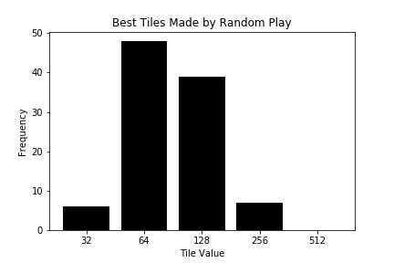
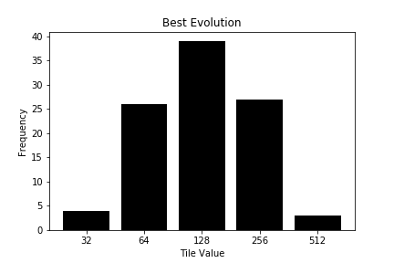
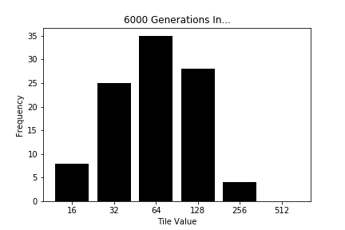

# Player of Games
a Neural Net Learning to play the game 2048 project. 

## The problem space: the game 2048:

2048 is a tile sliding game played on a 4 x 4 grid. The game starts with a board containing one tile, either a 2 or a 4. Every turn, the player may chose a direction to merge tiles. A merge can happen up, down, left, or right. In the merge, 0s are ignored, and tiles of same value combine into tiles worth twice their value. For example, a right merge:

<pre>
0  0 2 2    0  0 0  4
8  0 8 0    0  0 0 16
4  4 4 4 -> 0  0 8  8
16 8 4 0    0 16 8  4
</pre>

  
the top row, the twos slide to the right and form a 4. the next row, the tiles ignore 8s, slide to the right, and merge into a 16, the third row, the rightmost 4s become an 8, and the leftmost tiles become an 8, all tiles slide to the right. The fourth row, all tiles slide to the right, filling the space the 8 left empty. 

After the execution of the player's move, the game adds a 2 or a 4, 80% of the time a 2, to a random 0 tile. If there are no 0 tiles, the game ends. 

The titular goal of the game is to build a tile valued 2048, though a human can acheive this fairly regularly after a little practice, and the game continues. Scoring is calculated based upon the value of the merges in a running sum. Combining a 2 with a 2 gives you 4 points, a 4 and a 4 8 points, thus, to get to 16, you'll have made at least 32 points, but likely more since a player is likely to combine, intenonally or unavoidably, more tiles than what they absolutely need to combine. 

# Tech used  
  
AWS EC2  
Python  
  Numpy  
  [Python-NEAT](https://neat-python.readthedocs.io/en/latest/index.html "Python-NEAT Documentation Overview")  
  Tensorflow  

# Alogorithms used:

## NEAT: Neuro Evolutionary

NEAT is an evolutionary method developed by KennethO.Stanley to create light neural nets from very minimal starts through speciation, growth through mutation, and historical tracking. Mutation allows it to approximate a stochastic grid search for better and better structures that maximize fitness. Historical tracking allows the induviduals to breed with simmilar induviduals and not with widely different ones, allowing for speciation to protect structures from incredibly damaging changes in reproduction, and minimal starts allows fast iteration and the discovery of very small structures that can accomplish the tasks. 

Essentially, you spin up a collection of very small (only your input nodes linked to your output nodes) neural nets with random weights, allow each one to try the environment, and some accrue a reward by accomplishing some step of the task. More rewards, higher fitness. Higher fitness, better chance to go on to further generations. Induvidauls breed, mutate, speciation develops and keeps widely out of tune members from breeding with one another. Over time, NEAT genomes become more and more fit. 

For more on NEAT, I'll refer you to Kenneth Stanley's [original paper](http://nn.cs.utexas.edu/downloads/papers/stanley.cec02.pdf "Efficient Evolution of Neural Network Topologies at the University of Texas") , which I found very helpful. 

## Q-Learning

Q Learning is a system of reinforcement learning where you use a neural net to approximate a table of best moves for every situation. The neural net is initialized with inputs matching how many imputs the environment has, a number of dense hidden layers, and a number of outputs equal to the number actions it may take. It then is fed the inputs of the environment, and one of its outputs lights up, according to the original random weighting of the Nueral Net. Essentially, it makes random moves. After doing random moves for a while, it will do something good or bad. In the case of 2048, Q-Learner's first good move was to combine a 2 with a 2 for a four, and running into a wall was its fist bad move. Every time Q-Learner does a good or bad thing, it gets re-trained on the board state that led to this outcome and its own predictions, in the good state, the predictions made by the Q learner that were the moves made are up-weighted in the re-training, in the bad state they are down-weighted. Previous game states are weighted less and less, with a time discount. Over many repititions, the Nueral Net is back-propigated to be a matrix that approximates the best moves for any layout of the situation. 

# Scripts in /src/

- The game environment is representation of the game that can run headlessly and uses Numpy for very fast moves, now held in src/g2048.py
- Made a Neat agent with specific Neat fitness metric for turning rewards into fitnesses for each induvidual in a generation in src/neat_2048.py
- Made a Q-Learning agent with Reward metric for re-training Q-Learingin in src/q_learn_2048.py
- Run those agents. They can be run from command line using arguments, or imported as classes and handled by their class methods. 
- use ai_demo to load an agent trained in these methods and display the skills of the learner at any point. 

# Results
While working on the project, I tried a bunch of different configurations for NEAT-python (now in the models/config file) and multiple different reward/fitness functions, but failed to find one that worke to develop a strong player of the game. I gave some iterations 1000 induviduals and 6000 generations, so its not my feeling that evolution was at fault, just that I hadn't yet hit on a fitness that was training the thing to play the game well. 

Remember, reaching the tile 2048 is the "goal" and bigger tiles involve adding smaller tiles together. Each order of two requires twice the gameplay time to get to. My AIs were only able to get to the 512 tile a small fraction of the time, and the 512 tile is only 1 fourth of the goal, 2048. 

  
A you can see, the Neat evolvers did get better than random play in its first thousand generations,, but letting them evolve did not even maintain that level of competence.

I then switched to the Q-Learner, and trained it for 2000 games. This is...much longer than it ought take to reach this level of fitness:

I charted the Q-Learner's improvement over time, and feel like there's likely further improvements to be made with further gameplay, but expect that the biggest problem is a poorly designed reward system. 

# Further steps: 
Use different reward mechanics...there's a huge space for exploration in those systems, and though much of my time on this project was spent monkeying with rewards, I still think there's a lot to gain in by improving that system.  

Update Q-Learner to re-train on different samples of past board states, some papers suggest grabbing a random sample of all previous board states as the training, or training on every move that led to that point.   

Train players of other games. 
